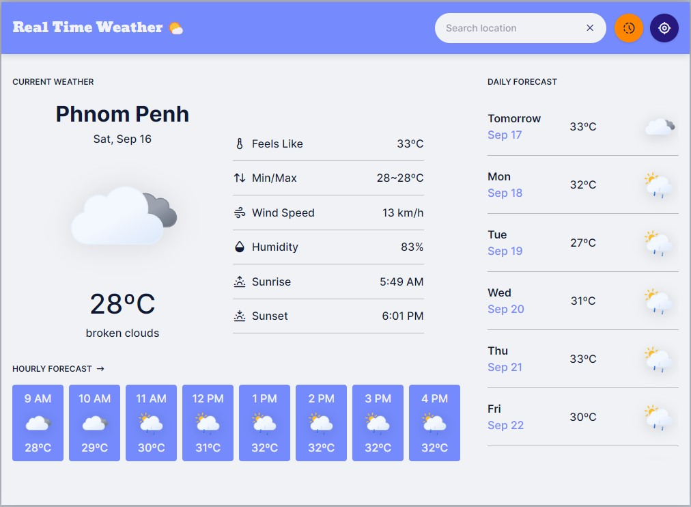

<h1>Table of Contents</h1>

- [Project Overview](#project_overview)
- [Key Points](#key)
- [Other](#other)
- [Version History](#ver_history)

 

<h1 id="project_overview">Project Overview</h1>

A weather app by Khim Phirom

**Link to the final product:** https://anb-hq.github.io/Fireflies-Phirom-Weather-App/

 

## Product Screenshort

 

## Tools used in This Project

- React with vite build tool - Link: https://vitejs.dev/
- Tabler icons - Link: https://tabler-icons.io/
- Google fonts - Link: https://fonts.google.com/
- Weather images pack by Meteocons - Link: https://bas.dev/work/meteocons
- Zustand React state management - Link: https://zustand-demo.pmnd.rs/
- Open weather API (Developer Plan) - Link: https://openweathermap.org/
- Location API from AnB fellow student [Lenghub1](https://github.com/Lenghub1) - Link: https://lenghub1.github.io/city_json/cityname_data.json

 

<h1 id="key">Key Points</h1>

## Reflection
Based on the feedback about the `Todo List App` I received from the AnB developer from AnB HQ last time about error handling, I have implemented it well in the current `Weather App` project.

**i.e.**, If users have no internet connectivity or do not allow the browser to access the location, It would display the Error UI with instructions to solve the error problems.

## What I Have Learned?

By building this project, I have learned how to :
- Setup reusable API urls with Axios JavaScript library.
- Create custom hooks.
- Build reusable components
- Fetch data from an API and render it on a web interface
- Make folder structure stay more organized
- Write better comments
- Error handling
- Setup Eslint and Prettier for consistent and clean code.

Also I have improved my understanding of Git/Github about :
- How to write better commit messages
- The importance of code reviews
- Working Git flow extension
- How to solve branch divergance.

 

<h1 id="other">Other</h1>

**Project documentation:** https://github.com/anb-hq/Fireflies-Phirom-Weather-App/tree/main/docs

---

**Figma:** [Weather App](https://www.figma.com/file/EZpdwdXUrv1SxyFKCq74oe/WEATHER-APP?type=design&node-id=0%3A1&mode=design&t=tIcCuCtCGCqmY1JD-1)

---

**Honorable Mention**

- This project wouldn't have been done without the guidance and the code references of fellow AnB student Mr. Moonlight, and the way he inspired me to do things like:
  - How should I organize my folder structure professionally, as doing this will help me be a better developer.
  - How should I write comments in my code.
  - How should I use certain development tools to achieve better application performance.
  - How should I structure my code, like:
    - Setting up the API.
    - Handling the API data with React state management...
  - How should I manage my project.
  - Overall, what I experienced with his work really excites me because it is something I was looking for when I joined AnB school.
- Thanks, to the other fellow AnB student as well, without their helps I definitely could not finish this project on time.
- I also owe a big shoutout to the [OpenWeatherMap](https://openweathermap.org/) for the free developer subscription.

 

<h1 id="ver_history">Version History</h1>

## Version 1.1.1

Sep 19, 2023

**hotfix**

- Fix Error UI and Loading UI display at the same time when location is disabled.
- Fix the application not load in IOS devices. 

## Version 1.1.0

Sep 18, 2023

**Features**

- Drop down search location
- Button that will fetch the weather based on user's current location
- Save the searched location as search history
  - The search histories can be access by clicking history button.

 

## Version 1.0.0

Sep 16, 2023

**Features**

- Get user real time geolocation and then, show the current weather, and the weather forecast based on user's geolocation.
